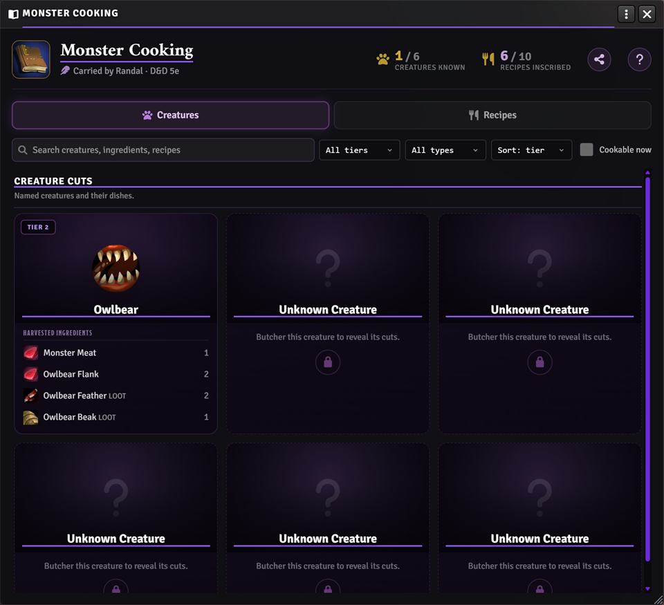
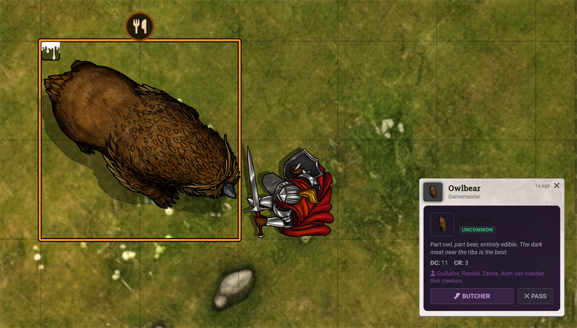
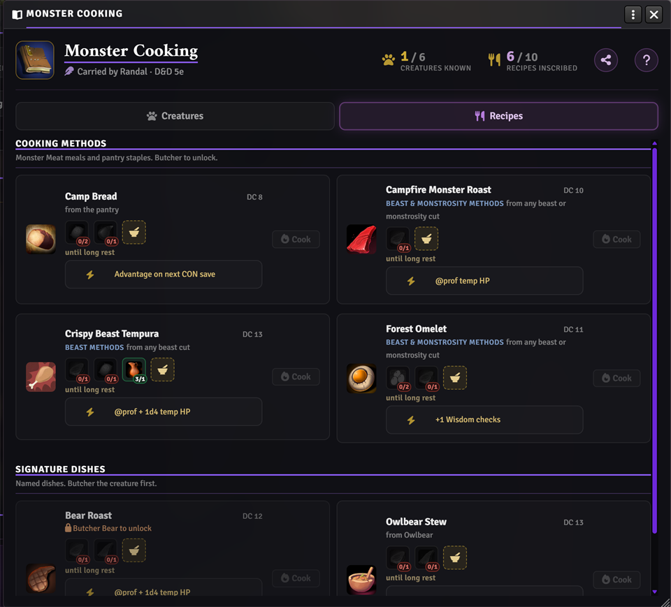

# Ionrift Monstrous Feast


**Butcher slain creatures into ingredients, cook from a shared party cookbook, and serve meal buffs.**



### Support Ionrift

[](https://patreon.com/ionrift)
[](https://discord.gg/vFGXf7Fncj)

> Setup guides and troubleshooting: **[Ionrift Wiki](https://github.com/ionrift-gm/ionrift-library/wiki)**

---

## How it works

1. **Butcher.** After a fight, the party can carve what they killed. A Survival roll decides how much you get, and how good the cuts are.



2. **Discover.** The shared **Monster Cooking** book remembers creatures you have butchered. Recipe pages found as loot can be inscribed to teach new dishes.
3. **Cook.** Whoever carries the book opens it, picks a recipe they know, and cooks with a Survival check. A chef background and proper gear help; improvising makes it harder.



4. **Serve.** The meal goes out to the party on the spot: shared buffs for the table. Nothing sits in inventory as leftover food items.

---

## Features

- Butcher after combat and collect ingredients from what you kill.
- One shared cookbook for what the party has learned: creatures and inscribed recipes.
- Living Cookbook for browsing, cooking, and a read-only journal view the whole table can open.
- Standard and ambitious meals, optional seasoning, and party serving with various buffs.
- Starter creatures, recipes, and pantry staples ship in the base module. Expand with your own JSON / homebrew.
- When Respite is installed too, rest-phase cooking can open this cookbook instead of the native crafting UI.

---

## Installation

1. Install from the manifest URL:
   `https://github.com/ionrift-gm/ionrift-monstrous-feast/releases/latest/download/module.json`
2. Enable **Monstrous Feast** and **Ionrift Library** in the world.
3. Reload. From the **Monstrous Feast Starter** compendium, add the **Monster Cooking** book to a player. One keeper is enough for the party. `/feast` opens the GM console.

Walkthrough: **[Setup: Monstrous Feast](https://github.com/ionrift-gm/ionrift-library/wiki/13-Setup-Monstrous-Feast)**

---

## Requirements

| Module / system | Required? | What it enables |
|-----------------|-----------|-----------------|
| [`ionrift-library`](https://github.com/ionrift-gm/ionrift-library) v2.5.12+ | **Yes** | Creature classification and meal buff support |
| DnD 5e or Pathfinder 2e | **Yes** | Butcher and cook rolls, meal buffs (PF2e uses Effect items; some buffs map only roughly) |
| [`ionrift-respite`](https://github.com/ionrift-gm/ionrift-respite) | Optional | Rest cooking handoff; ingredient spoilage when that flow is used |

---

## Quick test

```javascript
game.ionrift.monstrousFeast.grantBook(game.actors.getName("Your PC"))
game.ionrift.monstrousFeast.openLivingCookbook(bookItem, actor)
game.ionrift.monstrousFeast.cook(actor, "cook_campfire_monster_roast")
```

Example recipes to smoke-test:

- **Campfire Monster Roast:** 2x Monster Meat (from butchering)
- **Bear Roast:** Bear Haunch + Rations
- **Owlbear Stew:** Owlbear Flank + Rations

---

## Documentation

- **[Setup: Monstrous Feast](https://github.com/ionrift-gm/ionrift-library/wiki/13-Setup-Monstrous-Feast)**: install, settings, starter compendium
- **[Butchering and Cooking](https://github.com/ionrift-gm/ionrift-library/wiki/14-Monstrous-Feast-Butchering-and-Cooking)**: hunt-to-table loop
- **[Homebrew JSON](https://github.com/ionrift-gm/ionrift-library/wiki/15-Monstrous-Feast-Homebrew-JSON)**: world creatures and recipes

Feel free to share recipe JSON in **#community-packs** on the [Ionrift Discord](https://discord.gg/vFGXf7Fncj).

---

## Bug reports

1. Check the **[Ionrift Wiki](https://github.com/ionrift-gm/ionrift-library/wiki)** for troubleshooting.
2. Questions: **[Ionrift Discord](https://discord.gg/vFGXf7Fncj)** (Foundry version, module versions, console errors).
3. Open a **[GitHub Issue](https://github.com/ionrift-gm/ionrift-monstrous-feast/issues)**.

---

## License

Source code (scripts, styles, templates) and the bundled starter content are released under the [MIT License](LICENSE).

Creature and recipe expansion packs, delivered as separate content overlays, are copyright Ionrift and may not be redistributed separately.

---

**Part of the [Ionrift Module Suite](https://github.com/ionrift-gm)**

[Wiki](https://github.com/ionrift-gm/ionrift-library/wiki) · [Discord](https://discord.gg/vFGXf7Fncj) · [Patreon](https://patreon.com/ionrift)
